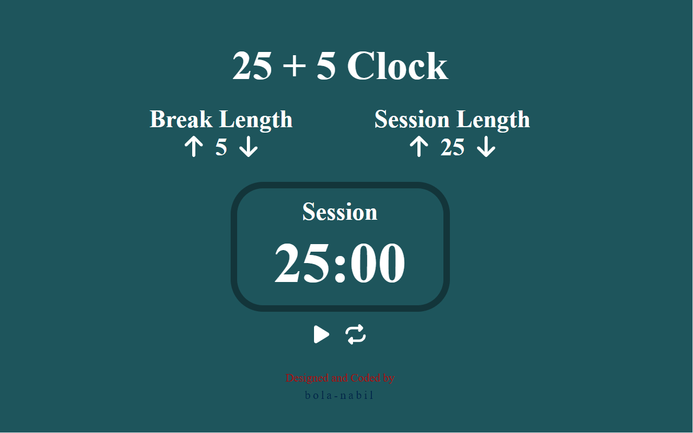

# 🕒 Clock App [(Pomodoro Focus Timer)](https://bola-nabil.github.io/clock/)

## 📖 Description
This project is a **Pomodoro-style productivity app** inspired by [Pomofocus](https://pomofocus.io/)
It helps users **manage time effectively**Features using the **Pomodoro Technique —** breaking work into focused intervals (usually 25 minutes) followed by short breaks.

Built with **React, Redux, and Redux Toolkit,** this app provides a simple, clean, and responsive interface to stay focused and productive.

---
## 📸 Preview


---
## ✨Features
- **Pomodoro Timer** – Start, pause, and reset work sessions
- **Customizable Intervals** – Set your own work and break durations
- **State Management with Redux Toolkit** – Timer and settings are managed centrally
- **Modern UI** – Responsive for both desktop and mobile

---
## 🛠️ Tech Stack
- **React** – Frontend framework
- **Redux Toolkit** – State management
- **React-Redux** – Connects components to global state

---
## 🚀 Getting Started
1. Clone the repo:
```
git clone https://github.com/bola-nabil/ebsar-frontend.git
```

2. Install dependencies:
```
npm install
```

3. Run the app:
```
npm run start
```
